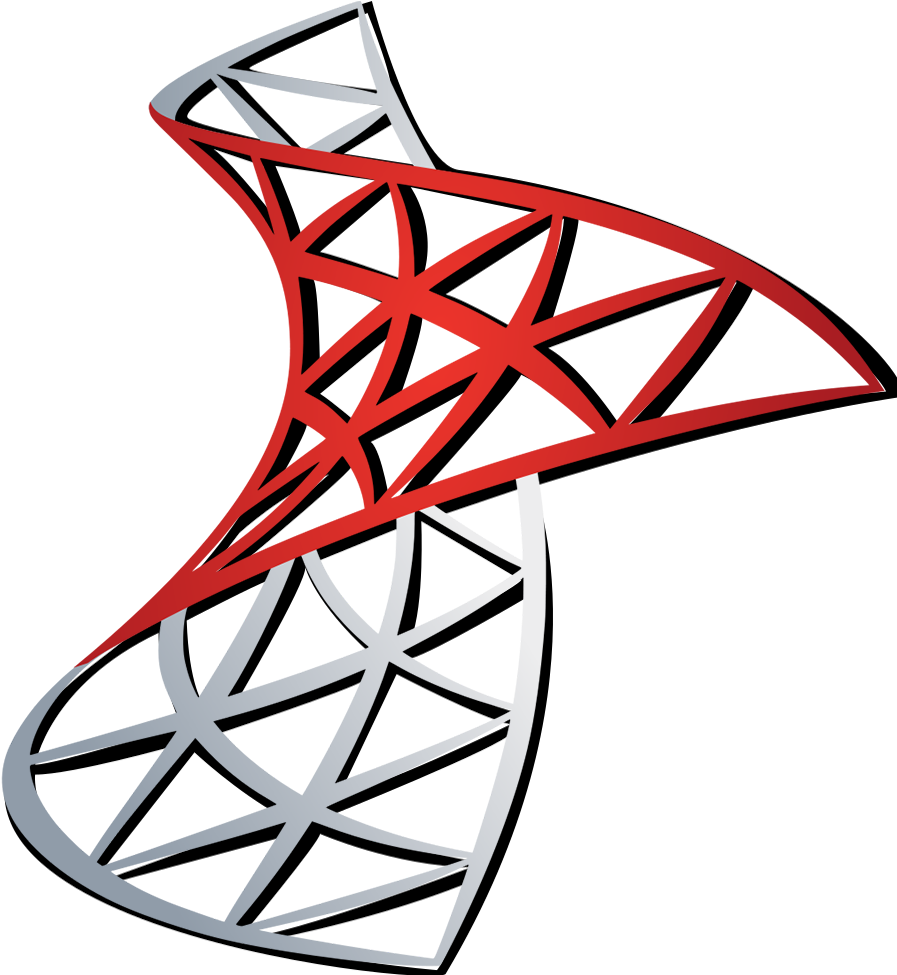

## Hi there! I'm Gervin 👋
I'm a software engineer working mostly on backend services for enterprise applications.

Outside of my day job, I enjoy reading about software development, and I love sharing about my learnings and experiences too! Check out my blog and our programming community below :point_down:

## 📫 How to reach me around the web
<ul style="list-style-type:none;">
    <li> I'm on <a href="https://www.linkedin.com/in/gervin-guevarra/">LinkedIn</a> </li>
    <li>📝 I write my blog on <a href="https://dev.to/gervg">Dev.to</a></li>
    <li>👯 I  am an admin at <b>Programming Philippines</b>, an online community of Filipino programmers
        <ul>
            <li><a href="https://discord.gg/6Nb9prc9nu"> Discord server</a></li>
            <li><a href="https://www.facebook.com/groups/649943542157470"> Facebook group</a></li>
        </ul>
    </li>
</ul>

## 🧰 Languages and Tools

## 📝 My Latest Blog Posts
<!-- BLOG-POST-LIST:START -->
<!-- BLOG-POST-LIST:END -->
